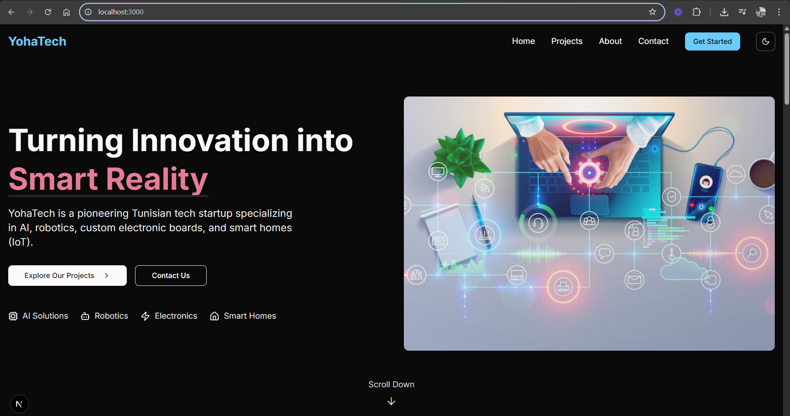
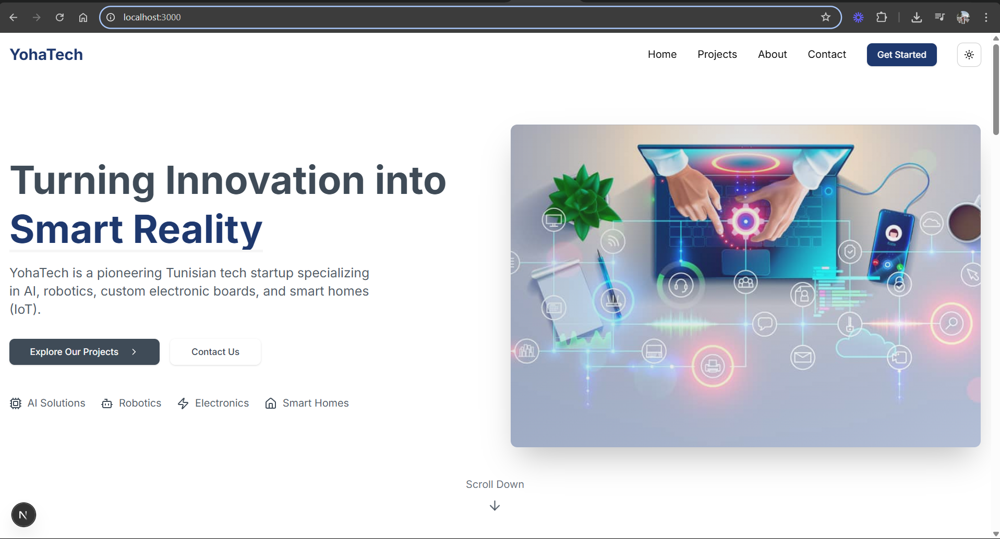

# Yohatech

### Chalenge Name: Développement et conception d’un site web pour YohaTech

Official website for **YohaTech**, a Tunisian startup specializing in AI, Robotics, Custom Electronics, and Smart Home IoT solutions.  
This project is built using **Next.js** with **npm** as the package manager.

---

 

## 🚀 Features

- Dynamic and responsive design
- Home page with animated banner
- "Our Projects" section showcasing services and products
- "About Us" page presenting the company's vision and expertise
- Functional contact form
- Modern UI with tech-inspired colors using Shadcn and Tailwindcss.
- Smooth scroll animations and sticky navigation

---

## 🛠️ Installation

Follow these steps to install and run the project locally:

1. **Clone the repository**:

```bash
git clone https://github.com/Jojoussef/yohatech.git
```

2. **Navigate to the project directory**:

```bash
cd yohatech
```

3. **Install dependencies**:

```bash
npm install
```

---

## 📈 Running the Project

To start the development server:

```bash
npm run dev
```

This will run the app in development mode.  
Open [http://localhost:3000](http://localhost:3000) to view it in your browser.

---

## 🔥 Building for Production

To create an optimized production build:

```bash
npm run build
```

Then, to start the production server:

```bash
npm start
```

---

## 📂 Project Structure

```
/yohatech
├── /public        # Static files (images, icons, etc.)
├── /app           # Next.js app router directory (Home, About, Projects, Contact)
├── /components    # Reusable components (Navbar, Footer, Forms, etc.)
├── /styles        # Global and component-specific CSS
├── package.json   # Project dependencies and scripts
└── README.md      # Project documentation
```

---


## 📄 License

This project is licensed under the **MIT License**.  
Feel free to use and adapt it with attribution.
